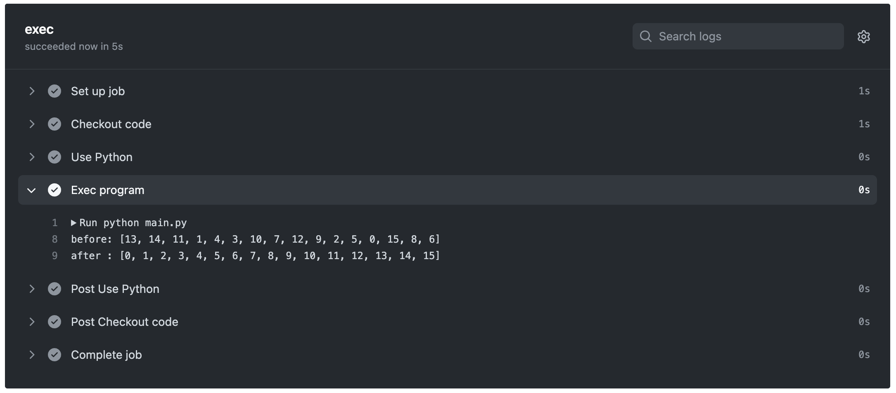

# bitonic-sort.py

🗣️🗣️🗣️ バイトニックソートをPythonで実装してみたよ！  

  

## 実行方法

```shell
# Dockerを使用する場合。
docker build -t bitonic-sort .
docker run -it --rm bitonic-sort

# Dockerを使用しない場合。
python main.py
```
